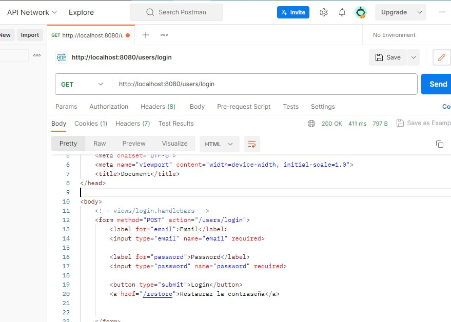
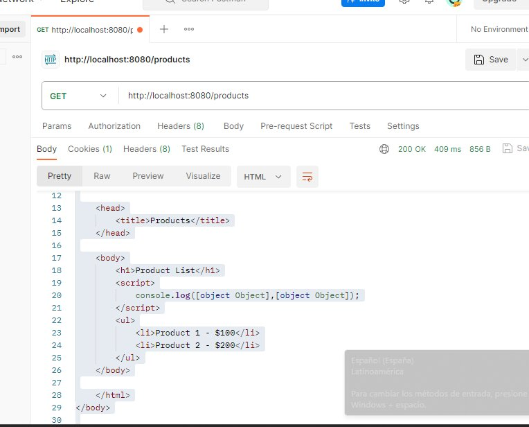
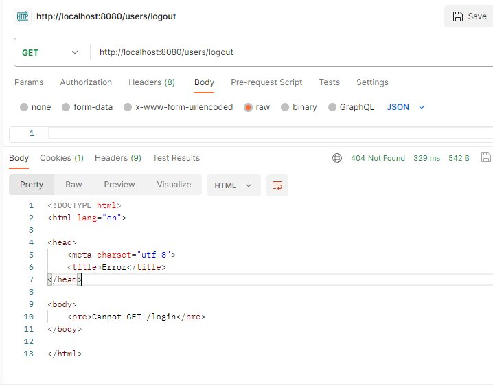
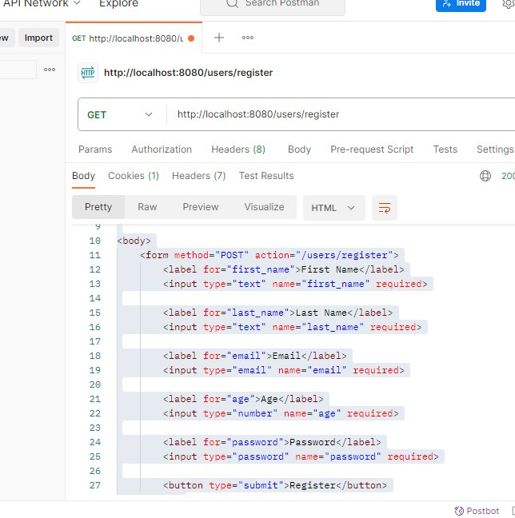

# Refactor to our login

## Overview

This project focuses on providing secure and user-friendly authentication features for users. It includes hashing passwords using Bcrypt, integrating Passport for smooth registration and login, and allowing GitHub authentication for enhanced user convenience.

## Hashing Passwords using Bcrypt

To enhance security, we use Bcrypt to hash passwords before storing them in the database. This process transforms plain-text passwords into a secure hashed representation. Here's how Bcrypt helps:

- **Hashing**: Bcrypt converts passwords into a hash string, making it computationally intensive for attackers to reverse-engineer the original password.
  
- **Salting**: Bcrypt automatically generates and appends a random "salt" to each password before hashing. This further strengthens the security of the hashed password.

## Implementation of Passport for Register and Login

Passport.js, a widely-used authentication middleware, is implemented for user registration and login processes. Passport provides several strategies for authentication, including local authentication and OAuth. Here's how we use it:

- **Local Authentication**: Passport's local strategy is used for registering and logging in users with their email and password.

- **Middleware Integration**: Passport middleware is integrated into the authentication flow, allowing for efficient and secure user authentication.

- **Customization**: Passport is customized to suit our application's specific authentication needs and provide a seamless experience to users.

## GitHub Authentication Method on the Login View

In addition to traditional login methods, our application offers GitHub authentication. This allows users to log in using their GitHub credentials. The benefits of GitHub authentication include:

- **Convenience**: Users can log in using their existing GitHub accounts, eliminating the need to remember additional login credentials.

- **Security**: GitHub authentication leverages GitHub's secure authentication system, enhancing the overall security of our application.

## Setup

1. Install the Required Dependencies:

Navigate to the project directory and install the necessary dependencies using npm (Node Package Manager). Run the following command: 
- **cd your-repository npm install**
 
 This will install all the required packages and libraries as specified in the package.json file.

2.  Set Up the Database:

Configure your database settings as per the instructions in the project. Ensure you have a running instance of a database (e.g., MongoDB) and update the configuration accordingly.

3. Start the Server: by running the following command:
- **npm start**
This will initiate the server, and it will start listening on the specified port (usually 8080). You can now access the application by navigating to http://localhost:8080 in your web browser.

4. Open your web browser and enter http://localhost:8080 to access the application. From there, you can register as a new user or log in if you already have an account.

# Endpoints

## Login Page
- **Endpoint:** `/login`
- **HTTP Method:** GET
- **Description:** Renders the login page for users to enter their credentials and authenticate.

## Registration Page
- **Endpoint:** `/register`
- **HTTP Method:** POST
- **Description:** Handles the registration of a new user based on the provided data.

## User Login
- **Endpoint:** `/login`
- **HTTP Method:** POST
- **Description:** Handles user login based on the provided email and password.

## User Logout
- **Endpoint:** `/logout`
- **HTTP Method:** GET
- **Description:** Initiates the user logout process, destroying the session and redirecting to the login page.

## Endpoints Overview

### GET: users/login

### GET: users/products

### GET: users/logout

### POST: users/register

## MongoDB Atlas Collections

## Contact

For further inquiries or assistance, please reach out to:

**Lenin Acosta**
- GitHub: [implementacion-login](https://github.com/Leninead/implementacion-login.git)
- LinkedIn: [Profile](https://www.linkedin.com/in/lenin-acosta-b32b8a262/)
- Email: [Lenin Acosta](mailto:leninacosta2107@gmail.com)

