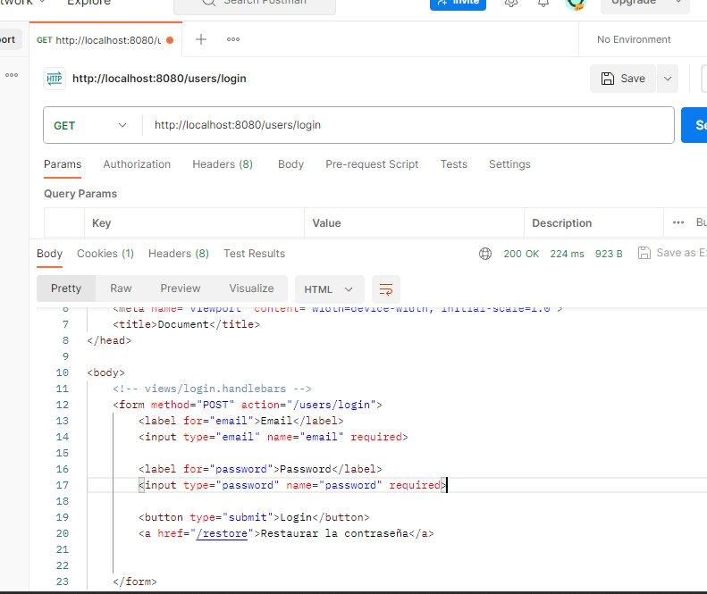
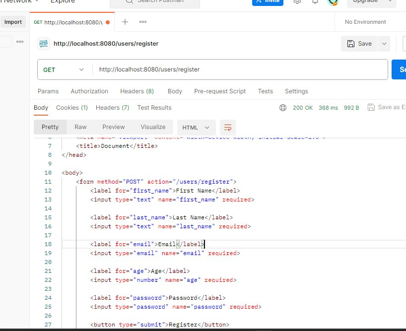
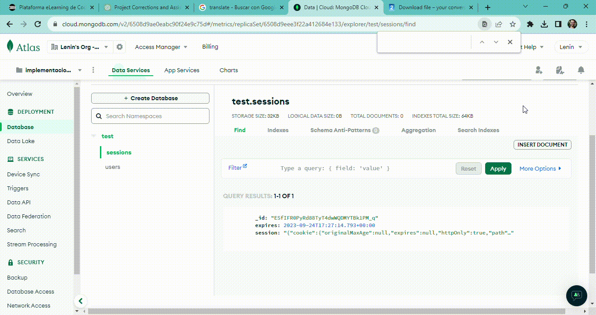

# Login System Implementation

This project implements a login system for a web application.

## Introduction

The aim of this project is to implement a login system into our main server. The project includes necessary views and routes for registration and login. After successful login, users are redirected to the products view.

## Features

- User registration and login:
`The application allows users to register and log in using their email and password. When users register, their data is securely stored in the database, and during login, the system authenticates their credentials. Passwords are hashed for security using bcrypt.`
- Redirect to products view after successful login:
`Upon successfully logging in, users are automatically redirected to the products view, providing a seamless transition into the main functionality of the application..`
- Display welcome message with user details on the products view:
`For a personalized experience, the products view displays a welcome message that includes the user's details. This message provides a friendly greeting to the user, enhancing the user experience.`
- Role-based system: 'admin' and 'usuario':
`The application implements a role-based system to distinguish between regular users ('usuario') and administrators ('admin'). Based on their role, users are granted different levels of access and privileges within the application. For example, an admin might have access to additional administrative functionalities.`
- Logout functionality
`The application offers a logout functionality, allowing users to securely end their session. Upon logout, the user's session data is destroyed, ensuring their information remains private and inaccessible.`

## Setup

1. Install the Required Dependencies:

Navigate to the project directory and install the necessary dependencies using npm (Node Package Manager). Run the following command: 
- **cd your-repository npm install**
 
 This will install all the required packages and libraries as specified in the package.json file.

2.  Set Up the Database:

Configure your database settings as per the instructions in the project. Ensure you have a running instance of a database (e.g., MongoDB) and update the configuration accordingly.

3. Start the Server: by running the following command:
- **npm start**
This will initiate the server, and it will start listening on the specified port (usually 8080). You can now access the application by navigating to http://localhost:8080 in your web browser.

4. Open your web browser and enter http://localhost:8080 to access the application. From there, you can register as a new user or log in if you already have an account.

## Endpoints

### User Registration and Login

- **GET `/users/register`**: Display the registration page where users can sign up with their details.

- **POST `/users/register`**: Handle user registration. Requires a JSON object with user registration data (firstName, lastName, email, age, password).

- **GET `/users/login`**: Display the login page where users can enter their credentials.

- **POST `/users/login`**: Handle user login. Requires a JSON object with user login data (email, password).

### Redirect to Products View after Successful Login

- Upon successful login, users are redirected to the products view (`/products`) where they can view available products.

### Display Welcome Message with User Details on the Products View

- **GET `/products`**: Display the products view with a welcome message containing user details.

### Role-Based System: 'admin' and 'usuario'

- Implement a role-based system differentiating between 'admin' and 'usuario' (user). This may affect application behavior based on the user's role.

### Logout Functionality

- **GET `/users/logout`**: Handle user logout, destroying the session and redirecting to the login view.

## Endpoints Overview

### GET: users/login

### GET: users/logout

### GET: users/register

### POST: users/register

## MongoDB Atlas Collections

## Contact

For further inquiries or assistance, please reach out to:

**Lenin Acosta**
- GitHub: [implementacion-login](https://github.com/Leninead/implementacion-login.git)
- LinkedIn: [Profile](https://www.linkedin.com/in/lenin-acosta-b32b8a262/)
- Email: [Lenin Acosta](mailto:leninacosta2107@gmail.com)

